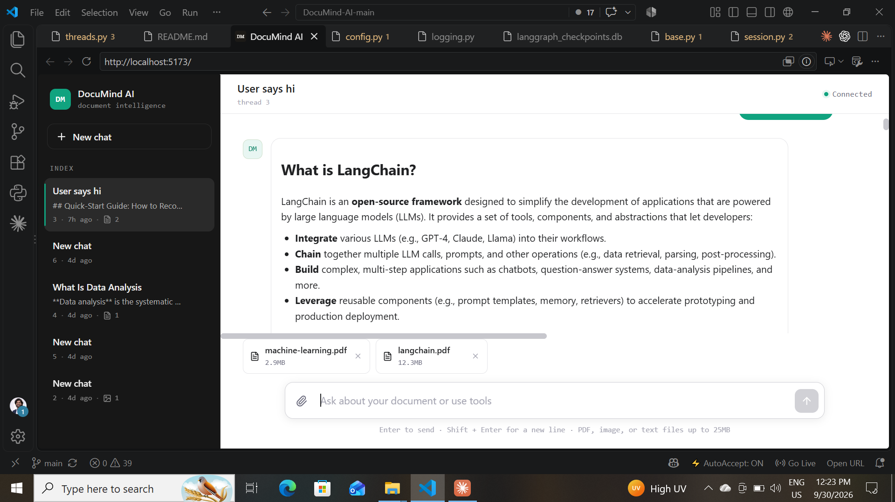
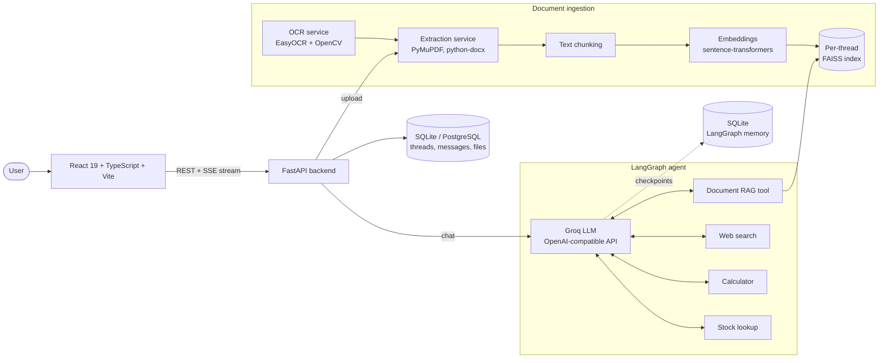

<div align="center">

# 📄 DocuMind AI

**Chat with your documents. PDFs, Word files, and scanned images, answered in real time with an AI agent.**




<!-- Optional: replace the screenshot above with a demo GIF -->
<!--  -->

</div>

## ✨ Features

- **Multi-format ingestion:** PDF, DOCX, TXT, Markdown, CSV, and images (PNG, JPG, WEBP, GIF).
- **OCR for scanned documents:** EasyOCR + OpenCV extract text from photos and scanned PDFs.
- **Retrieval-augmented answers:** per-thread FAISS vector stores with local sentence-transformer embeddings.
- **Tool-calling agent (LangGraph):** document RAG, web search, calculator, and stock lookup, chosen automatically per question.
- **Streaming responses:** token-by-token answers over Server-Sent Events.
- **Durable conversation memory:** LangGraph SQLite checkpointer keeps thread context across restarts.
- **One-command deployment:** Docker Compose runs the frontend, backend, and PostgreSQL.

## 🏗️ Architecture



**Request flow:** a file is uploaded, then text is extracted (with OCR when needed), chunked, embedded, and stored in that thread's FAISS index. When the user asks a question, the LangGraph agent decides whether to retrieve from the document or call another tool, then streams the Groq-generated answer back over SSE.

DocuMind AI is a document chat workspace. The React/Vite frontend supports threads, file uploads, streamed answers, and a mock mode for UI development. The FastAPI backend extracts text from PDFs, images, Word files, and text files, indexes documents with per-thread FAISS stores, and uses Groq for generated answers.

## Current architecture

- **Frontend:** React 19, TypeScript, Vite, served by Vite in development or Nginx in Docker.
- **Backend:** FastAPI and Uvicorn.
- **Metadata:** SQLite by default for local development; PostgreSQL is supported by Compose.
- **Document retrieval:** FAISS in memory per conversation. Indexes are rebuilt from completed documents after a backend restart.
- **LLM:** Groq's OpenAI-compatible API.
- **Agent orchestration:** LangGraph with a SQLite checkpointer for conversation memory, and tools for document RAG, web search, calculator, and stock lookup.
- **Embeddings:** local `sentence-transformers` models via LangChain's HuggingFace integration.
- **OCR and extraction:** EasyOCR, OpenCV, PyMuPDF, python-docx, Pillow, and Poppler utilities.

## Requirements

- Python 3.11 or newer
- Node.js 20 or newer
- Docker Desktop, only if using Compose
- A Groq API key for generated answers

## Local development

### Backend

From the repository root in PowerShell:

```powershell
cd backend
python -m venv .venv
.\.venv\Scripts\Activate.ps1
pip install -r requirements.txt
python -m uvicorn app.main:app --reload --host 0.0.0.0 --port 8000
```

The backend reads `backend/.env`. The local configuration uses SQLite, so PostgreSQL is not required for local development. `backend/.env.example` is a PostgreSQL-oriented template for deployments; copy it only when you intend to use PostgreSQL, then set `GROQ_API_KEY`:

```powershell
Copy-Item .env.example .env
```

For Render, set `DATABASE_URL` to the linked PostgreSQL service's **Internal Database URL**. Alternatively, set that URL in `DATABASE_PRIVATE_URL`; the backend uses it when `DATABASE_URL` is empty, SQLite, or incorrectly points to `localhost`. Do not use a Render PostgreSQL `localhost` URL from the web service.

The API is available at `http://localhost:8000`; interactive documentation is at `http://localhost:8000/docs` and the health check is at `http://localhost:8000/health`.

### Frontend

In a second terminal:

```powershell
cd frontend
npm install
Copy-Item .env.example .env
npm run dev
```

For the live backend, use:

```env
VITE_USE_MOCK_API=false
VITE_API_BASE_URL=http://localhost:8000
```

The Vite development server normally runs at `http://localhost:5173`. When `VITE_USE_MOCK_API=true`, the frontend works without the backend.

## Docker Compose

Compose starts PostgreSQL, the FastAPI backend, and the Nginx-served frontend:

```powershell
docker compose up --build
```

Services:

| Service | URL |
| --- | --- |
| Frontend | http://localhost:3000 |
| Backend API | http://localhost:8000 |
| API docs | http://localhost:8000/docs |
| PostgreSQL | localhost:5432 |

The Compose backend receives its PostgreSQL URL and Groq settings from the environment. Set `GROQ_API_KEY` in the repository-root `.env` before starting Compose. Uploaded files are persisted in `backend/data`, while PostgreSQL uses a named Docker volume.

Stop the services with:

```powershell
docker compose down
```

## Workspace API

The frontend uses these endpoints:

| Method | Endpoint | Purpose |
| --- | --- | --- |
| `GET` | `/api/threads` | List conversation threads |
| `POST` | `/api/threads` | Create a thread |
| `DELETE` | `/api/threads/{id}` | Delete a thread |
| `GET` | `/api/threads/{id}/messages` | Load message history |
| `POST` | `/api/threads/{id}/files` | Upload one document using multipart field `file` |
| `DELETE` | `/api/threads/{id}/files/{fileId}` | Delete an attachment |
| `POST` | `/api/threads/{id}/chat/stream` | Stream an answer as SSE |
| `POST` | `/api/threads/{id}/chat` | Non-streaming chat fallback |

Supported uploads include PDF, DOCX, TXT, Markdown, CSV, PNG, JPG, JPEG, WEBP, and GIF files.

## Useful commands

```powershell
# Backend syntax/import check
cd backend
python -c "import sys; sys.path.insert(0, 'app'); import main; print('IMPORT_OK')"

# Frontend type-check and production build
cd ..\frontend
npm run build

# Frontend lint
npm run lint
```

## Project layout

```text
backend/
  app/
    main.py                 FastAPI application entrypoint
    api/routes/threads.py   Workspace chat, uploads, and SSE routes
    services/                Extraction, OCR, LLM, and RAG services
    models/                  SQLAlchemy models
  data/uploads/             Persistent uploaded documents
  Dockerfile

frontend/
  src/api/                  API client, routes, mock mode, SSE parser
  src/components/            Chat workspace UI
  src/hooks/                 Thread, chat, and upload state
  Dockerfile                Vite build plus Nginx runtime

docker-compose.yml          Full local container stack
```

## Configuration notes

- Never commit real API keys. The repository-root `.env` is used for local provider settings and Compose interpolation.
- `backend/.env` controls local backend settings and defaults to SQLite.
- The frontend API paths are centralized in `frontend/src/api/endpoints.ts`.
- FAISS indexes are process-local. Completed uploaded documents remain in the database and are re-indexed when they are needed after a restart.
